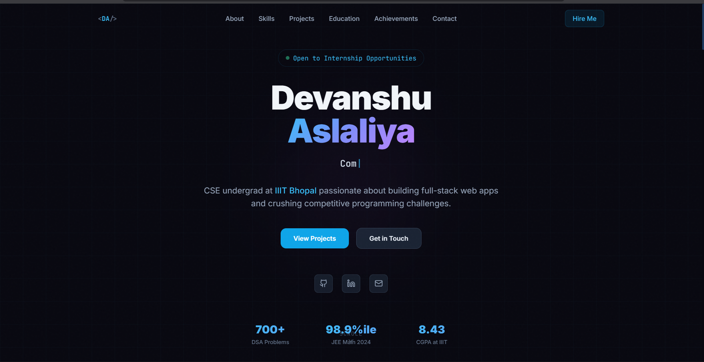

# 🌐 Devanshu Aslaliya | Personal Portfolio

A modern, responsive, and interactive personal portfolio website showcasing my projects, technical skills, education, and achievements. Built with **React**, **TypeScript**, **Tailwind CSS**, and **Vite**.

## 🚀 Live Website

🔗 **Live Demo:** https://my-portfolio-theta-lilac-91.vercel.app/

## 📸 Preview

[] (https://my-portfolio-theta-lilac-91.vercel.app/)

---

## ✨ Features

- Modern and responsive UI
- Smooth animations and transitions
- Interactive Skills section
- Featured Projects showcase
- Education & Achievements timeline
- Contact section with social links
- Optimized for desktop and mobile devices

---

## 🛠️ Tech Stack

### Frontend

- React
- TypeScript
- Tailwind CSS
- Vite

### Tools

- Git
- GitHub
- Vercel
- VS Code
- npm

---

## 📂 Project Structure

```text
Portfolio/
│
├── README.md
│
└── frontend/
    ├── public/
    │   └── preview.png
    ├── src/
    ├── package.json
    ├── vite.config.ts
    └── ...
```

---

## 🚀 Getting Started

Clone the repository:

```bash
git clone https://github.com/Devanshu90/my-portfolio.git
```

Navigate to the project directory:

```bash
cd my-portfolio/frontend
```

Install dependencies:

```bash
npm install
```

Run the development server:

```bash
npm run dev
```

Build the project:

```bash
npm run build
```

---

## 📬 Connect With Me

🌐 Portfolio  
https://my-portfolio-theta-lilac-91.vercel.app/

💻 GitHub  
https://github.com/Devanshu90

💼 LinkedIn  
https://www.linkedin.com/in/devanshu-aslaliya-1027b6324/

---

## 👨‍💻 About Me

I'm **Devanshu Aslaliya**, a B.Tech CSE undergraduate at **IIIT Bhopal** with a strong interest in **Full-Stack Development**, **Competitive Programming**, and building scalable web applications.

---

## ⭐ Support

If you found this project helpful or interesting, consider giving it a ⭐ on GitHub.
